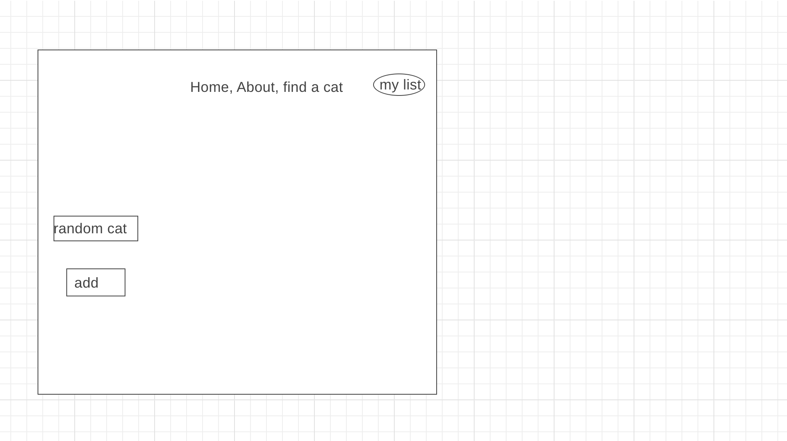

## Project Name:
adopt cats

## Description
>its about adopt cats when the customer want to see some cats will go to " find cat" and there is a button "random cat" when they click on it will get a pic for random cats and there is add button when they add it, it will go to " my list " and there is two buttons can delete one cat or all the cats 

## demo
[adopt a cat](https://nawaldee21.github.io/MyCart)

## user Stories
- As a user, I should be able to click on button find a cat.
- As a user, i should be able to click on button to find a random cat.
- As a user, i should be able to click on button add.
- As a user, i should be able to click on button my list to see all my cats.
- As a user, i should be able to delete one pic.
- As a user, i should be able to delete all photos

## Technology:
- CSS
- java script 
- API
- react
- visualcode 

## screenshot

